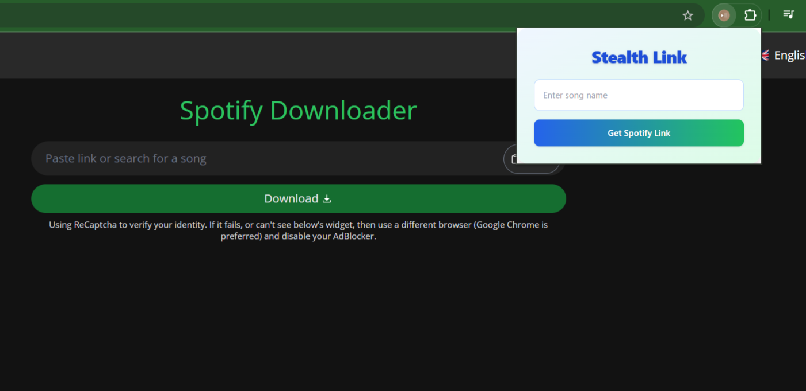
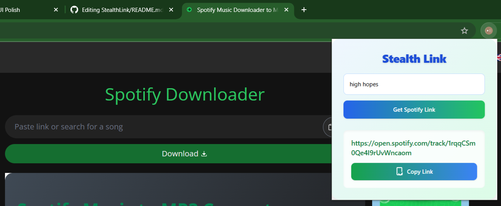
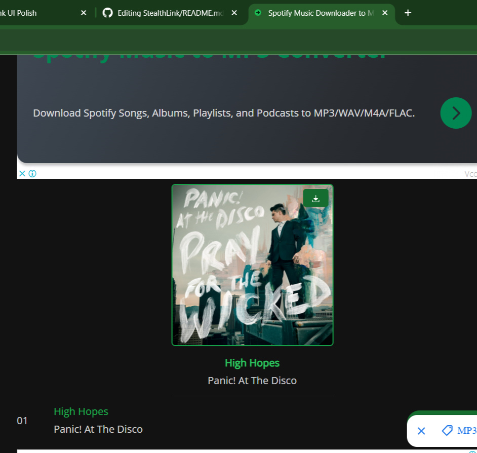

# 🎧 Stealth Link

**Fast. Quiet. Simple.**  
A Chrome extension that fetches Spotify track links instantly — no need to open the app or search manually.

---

## 🚀 Features

- 🔍 **Quick Search**: Type a song name and get the Spotify link instantly.
- 📋 **One-Click Copy**: Click to copy the link to your clipboard.
- 🎯 **Lightweight & Fast**: Built for speed with a sleek interface.
- 🔐 **Secure**: Uses Spotify’s official Web API for reliable results.

---

## 📸 Demo

# 🎧 Stealth Link

**Fast. Quiet. Simple.**  
A Chrome extension that fetches Spotify track links instantly — no need to open the app or search manually.

---

## 🚀 Features

- 🔍 **Quick Search**: Type a song name and get the Spotify link instantly.
- 📋 **One-Click Copy**: Click to copy the link to your clipboard.
- 🎯 **Lightweight & Fast**: Built for speed with a sleek interface.
- 🔐 **Secure**: Uses Spotify’s official Web API for reliable results.

---

## 📸 Demo

## 📷 Screenshots

## 🛠️ Tech Stack

- **Frontend**: React + Tailwind CSS
- **API**: Spotify Web API
- **Build Tool**: Vite
- **Browser APIs**: Chrome Extension Manifest V3

---

## 📂 Folder Structure

## 🛠️ Tech Stack

- **Frontend**: React + Tailwind CSS
- **API**: Spotify Web API
- **Build Tool**: Vite
- **Browser APIs**: Chrome Extension Manifest V3

---

## 📂 Folder Structure

Live Demo

stealthlin.netlify.app
